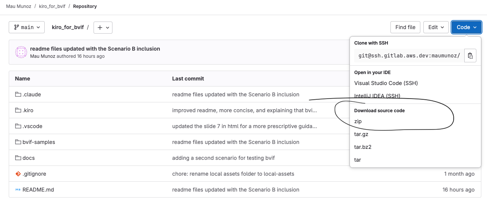
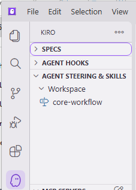
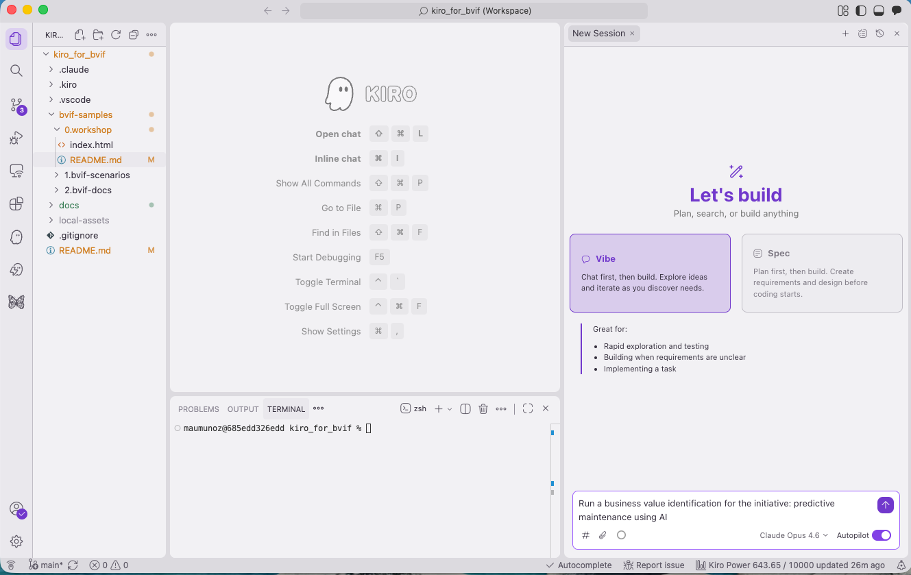

# Kiro para BVIF

**BVIF es un marco sistemático para convertir una iniciativa de IA en una evaluación cuantificada de valor de negocio.** Partiendo de una descripción en lenguaje sencillo de la iniciativa, te guía para definir las métricas correctas, evaluar qué tan factible es medir cada una, recolectar datos y calcular un valor de negocio anualizado que está anclado en evidencia y es trazable de principio a fin.

Este repo facilita aplicar BVIF al empaquetarlo como un flujo de trabajo de steering del IDE Kiro que te guía a través del proceso y mantiene un registro de auditoría completo.

Ejemplos resueltos de principio a fin — cliente ficticio, documento de guion y conjunto completo de artefactos de una ejecución BVIF terminada — viven en la carpeta [`bvif-samples/`](bvif-samples/). El repo actualmente incluye dos escenarios (Precision Furniture Inc. y Clube Esportivo Bandeirantes) y puede incluir escenarios adicionales en el futuro. Consulta el [Apéndice C — Muestras resueltas](#apéndice-c--muestras-resueltas) para ver una forma sugerida de usarlos como ejercicio de aprendizaje.

## ¿Qué es este repositorio?

Una carpeta `.kiro/` lista para usar que convierte un espacio de trabajo del IDE Kiro en una sesión BVIF guiada. Cuando Kiro carga, lee `.kiro/steering/bvif-rules/core-workflow.md` como una regla de steering siempre incluida, que instruye al agente para guiarte a través del proceso BVIF de 7 etapas (Descubrimiento → Métricas → Cuantificación).

```
.kiro/
├── steering/
│   └── bvif-rules/
│       └── core-workflow.md          # Regla de steering que Kiro toma automáticamente
└── bvif-rule-details/
    ├── common/                       # Guía compartida (mensaje de bienvenida, formato de preguntas, continuidad)
    └── stages/                       # Playbooks por etapa (configuración de sesión + etapas 1–7)
        └── agents/                   # Definiciones de sub-agentes para etapas que usan delegación

bvif-samples/                          # Ejemplos resueltos y diapositivas del taller (ver Apéndice C)
├── 0.workshop/                        # Presentación HTML para talleres guiados
├── 1.bvif-scenarios/                  # Una carpeta por escenario ficticio
│   ├── scenario_A-Manufacturing-company/
│   └── scenario_B-Sport-club/
└── 2.bvif-docs/                       # Artefactos de referencia de ejecuciones completas de cada escenario
docs/                                  # Recursos de documentación (imágenes, capturas)
```

## Requisitos previos

- **Requerido:** [IDE Kiro](https://kiro.dev/) instalado.
- **Opcional:** `git` en tu PATH y acceso SSH a `gitlab.aws.dev` — solo se necesita si clonas el repo vía SSH (Opción A en el Paso 2). Sin ellos, usa la ruta de descarga del zip (Opción B).

## Preparación

La preparación toma tres pasos:

1. **Crea una carpeta de espacio de trabajo** para BVIF en tu máquina local.
2. **Copia la carpeta `.kiro/`** en ese espacio de trabajo.
3. **Abre el espacio de trabajo en Kiro** y verifica que la regla de steering se cargó.

### Paso 1 — Crea una carpeta de espacio de trabajo

Crea una carpeta vacía en cualquier lugar de tu máquina local donde tengas permiso de escritura (p. ej., `~/workspace-bvif/`). La ruta no importa — Kiro usará esta carpeta como directorio base y escribirá todos los artefactos BVIF dentro de ella.

```bash
mkdir -p ~/workspace-bvif
```

### Paso 2 — Copia los archivos del proyecto en tu espacio de trabajo

Copia `.kiro/`, `bvif-samples/`, `docs/` y `README.md` — las reglas de steering, los escenarios resueltos, las capturas de apoyo y el README del proyecto. Puedes hacerlo de dos formas — elige la que se ajuste a tu entorno.

#### Opción A — Clonar con git (recomendada si tienes SSH configurado)

Abre una terminal en tu carpeta de espacio de trabajo (p. ej., `cd ~/workspace-bvif/`). Luego, ejecuta:

```bash
git clone git@ssh.gitlab.aws.dev:maumunoz/kiro_for_bvif.git /tmp/kiro_for_bvif
cp -R /tmp/kiro_for_bvif/.kiro /tmp/kiro_for_bvif/bvif-samples /tmp/kiro_for_bvif/docs /tmp/kiro_for_bvif/README.md .
rm -rf /tmp/kiro_for_bvif
```

#### Opción B — Descargar el archivo fuente desde GitLab

Si no tienes SSH configurado, navega a la página del proyecto en [https://gitlab.aws.dev/maumunoz/kiro_for_bvif](https://gitlab.aws.dev/maumunoz/kiro_for_bvif), haz clic en el botón **Code** arriba a la derecha y elige **Download source code → zip** (o cualquier otro formato de archivo).



Descomprime el archivo, luego copia `.kiro/`, `bvif-samples/`, `docs/` y `README.md` del contenido extraído a tu carpeta de espacio de trabajo.

Después de este paso, tu espacio de trabajo en disco debería verse algo así:

```
~/workspace-bvif/                ← el espacio de trabajo para la ejecución de BVIF
├── .kiro/                       ← reglas de BVIF (archivos de steering que Kiro lee automáticamente)
│   ├── steering/
│   └── bvif-rule-details/
├── bvif-samples/                ← escenarios resueltos + ejecuciones de referencia + presentación del taller
│   ├── 0.workshop/
│   ├── 1.bvif-scenarios/
│   └── 2.bvif-docs/
├── docs/                        ← capturas referenciadas por los README
└── README.md
```

> **Para actualizar BVIF más adelante**: vuelve a ejecutar los comandos de la Opción A (o vuelve a descargar el archivo). Son seguros de repetir — la copia sobrescribe los archivos existentes con las versiones más recientes.

### Paso 3 — Abre el espacio de trabajo en Kiro

Kiro carga las reglas de steering desde la carpeta `.kiro/` del directorio que abras como raíz del espacio de trabajo. La carpeta que abras DEBE ser la que **contiene directamente** `.kiro/`.

En Kiro: **File → Open Folder…** y selecciona la raíz del espacio de trabajo (p. ej., `~/workspace-bvif/`).

> **No hagas esto**:
> - ❌ Abrir el directorio padre (p. ej., `~/`) — Kiro no encontrará `.kiro/` y la regla de steering no se cargará.
> - ❌ Abrir la propia carpeta `.kiro/` — Kiro no la reconocerá como raíz del espacio de trabajo.

**Verifica que se cargó.** Haz clic en el **icono de Kiro** en la barra de actividad vertical del lado izquierdo del IDE. En el panel que se abre, expande **Agent steering & skills** y busca bajo la subsección **Workspace**. Deberías ver una entrada etiquetada **core-workflow**:



Si la entrada falta, lo más probable es que abriste la carpeta equivocada — cierra el espacio de trabajo y vuelve a abrir la que contiene directamente `.kiro/`.

Estás listo para ejecutar una sesión BVIF.

## Ejecutar una sesión BVIF

Abre el espacio de trabajo en Kiro, inicia una nueva sesión de chat y cambia a **Vibe mode**. Luego dale al agente un prompt como:

> Run a business value identification for `<título de tu iniciativa de IA>`.

Por ejemplo:

> Run a business value identification for the initiative: predictive maintenance using AI.



> **Nota:** Este prompt solo inicia el proceso y le da a la iniciativa un nombre significativo. El agente recopilará el resto de los detalles en las etapas siguientes.

Kiro mostrará el mensaje de bienvenida de BVIF, te pedirá confirmar el nombre de la iniciativa (usado para generar el slug de la carpeta), creará `bvif-docs/<NN>-<slug>-<yyyymm>/` y recorrerá las etapas — deteniéndose para tu aprobación entre cada una.

El nombre de la carpeta codifica tres piezas de información: `<NN>` es un número consecutivo, `<slug>` es un nombre descriptivo corto derivado de la iniciativa, y `<yyyymm>` es el año y mes en que se inició la sesión. Esto te permite ejecutar múltiples sesiones BVIF en el mismo espacio de trabajo y mantenerlas organizadas.

Una vez que la sesión inicia, tu espacio de trabajo contendrá una nueva carpeta `bvif-docs/`. Por ejemplo, si la iniciativa trata sobre usar IA para mantenimiento predictivo, podría verse algo así:

```
~/workspace-bvif/
├── .kiro/                       ← reglas de BVIF (de la Preparación)
└── bvif-docs/
    └── 01-predictive-maintenance-ai-202605/
        ├── bvif-state.md        ← registra qué etapas están completas
        ├── audit.md             ← registro completo de cada interacción
        ├── 00-session-setup/
        ├── 01-initiative-definition/
        ├── ...
        └── 07-final-results/
```

Las carpetas de etapa numeradas (`00-session-setup/`, `01-initiative-definition/`, etc.) se crean progresivamente a medida que la sesión avanza por cada etapa. Tanto `bvif-state.md` como `audit.md` registran el progreso de la sesión BVIF para esa iniciativa específica. Puedes cerrar y reabrir el espacio de trabajo y el agente retomará donde se quedó. Si existe más de una carpeta de iniciativa, el agente preguntará cuál quieres reanudar.

## (Opcional) Ejecuta BVIF con un cliente ficticio

Si quieres probar el marco antes de usarlo con un cliente real, el [Apéndice C](#apéndice-c--muestras-resueltas) proporciona guiones y artefactos de referencia para empresas ficticias. Actualmente hay dos escenarios disponibles: Precision Furniture Inc. (Escenario A) y Clube Esportivo Bandeirantes (Escenario B). Para una experiencia autoguiada paso a paso, abre la [presentación del taller](bvif-samples/0.workshop/index.html) en un navegador — te guía por uno de los escenarios, el proceso y consejos prácticos para ejecutar la sesión en Kiro.

---

## Apéndice A — Notas para el practicante

Dos notas breves que facilitan el uso diario. Ambas son de lectura opcional.

### Vista previa de archivos markdown

BVIF produce mucho markdown — archivos de preguntas, archivos de aprobación, el informe final. Para leerlos renderizados en lugar de como código fuente, usa la vista previa integrada de Kiro (sin necesidad de extensiones):

- `Cmd+K V` / `Ctrl+K V` — vista previa en un panel dividido junto al código fuente.
- `Cmd+Shift+V` / `Ctrl+Shift+V` — vista previa en la pestaña actual.
- Paleta de comandos → **Markdown: Open Preview to the Side**.

La vista previa se actualiza en vivo a medida que editas.

### Una nota sobre la Etapa 5 (Recolección de datos)

La Etapa 5 es la única etapa que puede pedirte compartir archivos. Al inicio de la etapa, Kiro preguntará cómo quieres proporcionar los datos:

- **Responder en línea** — Kiro crea un archivo markdown de seguimiento con una pregunta por cada dato por métrica. Completas las líneas `[Answer]:` directamente.
- **Subir documentos** — Kiro crea `bvif-docs/<INITIATIVE_FOLDER>/05-data-collection/uploads/` y te dice qué colocar. Pon archivos de texto plano o markdown ahí (exportaciones, memos, capturas de dashboard como texto). Kiro los lee, extrae los datos que puede encontrar con una referencia de fuente y una etiqueta de **fidelidad de la fuente** (Alta / Media / Baja — qué tan fielmente el valor extraído coincide con la fuente), y crea un archivo de validación para que confirmes cada valor y respondas cualquier pregunta de seguimiento para las brechas.

Puedes combinar ambos enfoques.  
Además, mantén binarios (PDFs, hojas de cálculo, imágenes) y cualquier cosa con secretos fuera de la carpeta `uploads/` — convierte o transcribe primero los números relevantes.

---

## Apéndice B — Cómo funciona el steering

Este apéndice explica qué ocurre bajo el capó. No necesitas leerlo para ejecutar una sesión BVIF, pero ayuda si quieres entender por qué los archivos aparecen donde aparecen, o si algo no se comporta como esperas.

- `.kiro/steering/bvif-rules/core-workflow.md` se carga como una regla de steering **siempre incluida**. Define las fases y etapas de BVIF e indica al agente que cargue archivos de apoyo desde `.kiro/bvif-rule-details/` bajo demanda.
- Las salidas producidas durante una sesión van a una carpeta `bvif-docs/` en la raíz del espacio de trabajo. **Cada iniciativa obtiene su propia subcarpeta** — el agente te pide el nombre de la iniciativa, construye un slug corto y crea `bvif-docs/<NN>-<slug>-<yyyymm>/` (p. ej. `bvif-docs/01-customer-churn-predictor-202604/`). Todos los artefactos de esa iniciativa — el archivo de estado, el registro de auditoría y cada subcarpeta de etapa — viven dentro de esa carpeta por iniciativa.
- `<NN>` es un contador con relleno de ceros que se incrementa con cada nueva iniciativa (`01`, `02`, `03`, …). `<yyyymm>` es el año y mes en que se inició la iniciativa. Esto te permite ejecutar múltiples sesiones BVIF en el mismo espacio de trabajo sin que los artefactos colisionen.

### Estructura de la carpeta de salida

```
bvif-docs/
├── 01-customer-churn-predictor-202604/     # Iniciativa #1 (ejemplo)
│   ├── 00-session-setup/                   # Contexto y configuración de la sesión
│   ├── 01-initiative-definition/           # Salidas de la Etapa 1
│   ├── 02-business-value-mapping/          # Salidas de la Etapa 2
│   ├── 03-metrics-identification/          # Salidas de la Etapa 3, Tareas 1 y 2
│   ├── 04-metrics-adjustment/              # Salidas de la Etapa 4
│   ├── 05-data-collection/                 # Salidas de la Etapa 5
│   │   └── uploads/                        # Opcional — para documentos de apoyo que compartes en la Etapa 5
│   ├── 06-business-value-calculation/      # Salidas de la Etapa 6
│   ├── 07-final-results/                   # Documento final de la Etapa 7
│   ├── bvif-state.md                       # Seguimiento de progreso (esta iniciativa)
│   └── audit.md                            # Registro de auditoría completo (esta iniciativa)
└── 02-contact-center-ai-assistant-202604/  # Iniciativa #2 (ejemplo)
    ├── 00-session-setup/
    ├── 01-initiative-definition/
    ├── ...
    ├── bvif-state.md
    └── audit.md
```

---

## Apéndice C — Muestras resueltas

La carpeta [`bvif-samples/`](bvif-samples/) contiene ejemplos resueltos de principio a fin de ejecuciones BVIF. Cada escenario vive en su propia subcarpeta bajo `bvif-samples/1.bvif-scenarios/`. Pueden agregarse escenarios adicionales en el futuro.

### Escenarios disponibles

| Carpeta | Cliente (ficticio) | Iniciativa de IA |
|---|---|---|
| `scenario_A-Manufacturing-company/` | Precision Furniture Inc. — fabricante de muebles de EE. UU. con tres plantas automatizadas | Mantenimiento predictivo usando IA |
| `scenario_B-Sport-club/` | Clube Esportivo Bandeirantes — club de fútbol brasileño de Série A con 75 mil socios | Predicción de abandono de membresías |

### Presentación del taller

Si prefieres una experiencia guiada paso a paso — o si estás ejecutando un taller BVIF para un equipo — abre [`bvif-samples/0.workshop/index.html`](bvif-samples/0.workshop/index.html) en cualquier navegador. Es una presentación HTML autocontenida (sin paso de compilación, sin dependencias) que recorre uno de los escenarios disponibles, muestra el resultado de BVIF, explica el proceso de 7 etapas y proporciona instrucciones prácticas para una sesión de taller práctica, incluido el trabajo previo, consejos para ejecutar la sesión en Kiro y una agenda sugerida. Las notas del presentador están integradas en cada diapositiva — presiona `N` para alternarlas.

### Qué hay en la carpeta de muestras

```
bvif-samples/
├── 0.workshop/                                         # Presentación HTML para un taller guiado
│   ├── index.html
│   └── README.md
├── 1.bvif-scenarios/                                   # Una carpeta por escenario ficticio
│   ├── README.md                                        # Orientación a través de todos los escenarios
│   ├── scenario_A-Manufacturing-company/               # Escenario A — Precision Furniture Inc.
│   │   ├── Scenario - Manufacturing company - Storyline.pdf
│   │   ├── Scenario - Manufacturing company - Storyline.docx
│   │   ├── Scenario - Manufacturing company - Storyline.md
│   │   └── Scenario - Manufacturing company - Storyline.txt
│   └── scenario_B-Sport-club/                          # Escenario B — Clube Esportivo Bandeirantes
│       └── Scenario B - Sport club - Storyline.md
└── 2.bvif-docs/                                        # Conjuntos de artefactos de referencia de ejecuciones completas
    ├── 01-predictive-maintenance-ai-202604/            # Ejecución completa del Escenario A
    │   ├── 00-session-setup/
    │   ├── 01-initiative-definition/
    │   ├── 02-business-value-mapping/
    │   ├── 03-metrics-identification/
    │   ├── 04-metrics-adjustment/
    │   ├── 05-data-collection/
    │   ├── 06-business-value-calculation/
    │   ├── 07-final-results/
    │   ├── bvif-state.md
    │   └── audit.md
    └── 02-membership-churn-prediction-202605/          # Ejecución completa del Escenario B
        ├── 00-session-setup/
        ├── ... (mismas subcarpetas de etapa que arriba)
        ├── bvif-state.md
        └── audit.md
```

- Los **archivos de guion** dentro de cada carpeta de escenario son idénticos entre formatos cuando se proporciona más de uno — elige el que sea más fácil de leer o de alimentar a un asistente de IA. Para la ruta de carga de la Etapa 5, usa `.md` o `.txt` (BVIF te pide explícitamente mantener binarios como `.pdf` y `.docx` fuera de `uploads/`). El Escenario A se entrega en los cuatro formatos; el Escenario B actualmente se entrega solo en `.md`.
- Las carpetas **`2.bvif-docs/<NN>-<slug>-<yyyymm>/`** son los árboles completos de artefactos de cada ejecución de referencia completada: cada archivo de preguntas, cada archivo de aprobación, el archivo de respuestas extraídas de la Etapa 5, el cálculo del valor de negocio con la aritmética y la tabla final consolidada de métricas. Trátalos como referencias — no como guiones — de cómo se ve lo "bueno" en cada etapa.

### Copia las muestras en tu espacio de trabajo

Las muestras son opcionales — el marco funciona sin ellas — por lo que no se copian con los comandos principales de [Preparación](#preparación). Para agregarlas, abre una terminal y ve a tu carpeta de espacio de trabajo de BVIF (p. ej., `~/workspace-bvif/`). Luego, ejecuta:

```bash
git clone git@ssh.gitlab.aws.dev:maumunoz/kiro_for_bvif.git /tmp/kiro_for_bvif
cp -R /tmp/kiro_for_bvif/bvif-samples .
rm -rf /tmp/kiro_for_bvif
```

(Si no borraste `/tmp/kiro_for_bvif` después de la preparación principal, no necesitas clonar de nuevo — solo ejecuta la línea `cp -R`.)

La carpeta `bvif-samples/` debe quedar **junto a `.kiro/`** en la raíz de tu espacio de trabajo, no dentro de `.kiro/`. Tu estructura debería verse así:

```
~/workspace-bvif/                    ← la carpeta que abres en Kiro
├── .kiro/                       ← del paso de Preparación principal
├── bvif-samples/                 ← agregada por este paso
│   ├── 0.workshop/
│   │   ├── index.html
│   │   └── README.md
│   ├── 1.bvif-scenarios/
│   │   ├── scenario_A-Manufacturing-company/
│   │   └── scenario_B-Sport-club/
│   └── 2.bvif-docs/
│       ├── 01-predictive-maintenance-ai-202604/
│       └── 02-membership-churn-prediction-202605/
└── bvif-docs/                   ← creada cuando inicias tu propia sesión BVIF (separada del 2.bvif-docs de las muestras)
```

Dos cosas a tener en cuenta:

- Los artefactos de tu propia sesión irán a `bvif-docs/` en la raíz del espacio de trabajo. Los artefactos de las ejecuciones de referencia permanecen dentro de `bvif-samples/2.bvif-docs/`. Los dos árboles son hermanos y nunca colisionan, así que puedes compararlos (diff) libremente.
- No muevas nada de `bvif-samples/2.bvif-docs/` al `bvif-docs/` de nivel de espacio de trabajo. La lógica de reanudación de Kiro escanea el `bvif-docs/` de nivel de espacio de trabajo en busca de carpetas de iniciativa, y mezclar ejecuciones de referencia confundiría la continuidad de la sesión.

### Forma recomendada de usar un escenario como ejercicio de aprendizaje

Las instrucciones siguientes usan el Escenario A (Precision Furniture Inc.) como ejemplo. El mismo enfoque aplica a cualquier escenario en `1.bvif-scenarios/` — incluido el Escenario B (Clube Esportivo Bandeirantes).

1. **Lee el guion** y conoce al cliente. Abre cualquiera de los archivos de guion en `bvif-samples/1.bvif-scenarios/scenario_A-Manufacturing-company/` (o `scenario_B-Sport-club/` para el Escenario B) y familiarízate con el cliente, su contexto de industria y los desafíos operativos que impulsan la iniciativa. Si lo prefieres, coloca el documento en un asistente de IA (incluido Kiro, fuera de una sesión BVIF) y pídele que resuma los hechos clave, los puntos de dolor y la iniciativa propuesta — es una forma rápida de absorber el contexto.
2. **Inicia una sesión BVIF** siguiendo las instrucciones de [Ejecutar una sesión BVIF](#ejecutar-una-sesión-bvif). Kiro escribirá los artefactos de tu propia sesión en la carpeta `bvif-docs/` de nivel de espacio de trabajo, que es hermana de `bvif-samples/` y completamente separada de los artefactos de la ejecución de referencia. **No** inicies tu sesión desde dentro de `bvif-samples/` — quieres los artefactos de referencia intactos para comparar después.
3. **Interpreta el papel** del consultor que ejecuta BVIF para el cliente, o de un representante del propio cliente. Responde los archivos de preguntas como si el guion fuera tu fuente de verdad. Puedes llevar la sesión en una dirección ligeramente distinta a la ejecución de referencia — eso es una característica, no un error, y te enseña cómo se adapta el marco.
4. **Prueba la ruta de carga en la Etapa 5**. Cuando Kiro pregunte cómo quieres proporcionar los datos, elige "subir documentos" y coloca la versión markdown (`.md`) o texto (`.txt`) del archivo de guion (o extractos de él) en la carpeta `uploads/` que crea. Verás cómo Kiro extrae datos con atribución de fuente y etiquetas de Fidelidad de la Fuente, y luego te pide validarlos. Compara sus extracciones con los artefactos de la Etapa 5 de la ejecución de referencia.
5. **Completa el proceso** y compara tu salida final con la ejecución de referencia correspondiente — `bvif-samples/2.bvif-docs/01-predictive-maintenance-ai-202604/07-final-results/final-results.md` para el Escenario A, o `bvif-samples/2.bvif-docs/02-membership-churn-prediction-202605/07-final-results/final-results.md` para el Escenario B. Las dos ejecuciones no necesitan coincidir — distintas decisiones de criterio, distintas selecciones de métricas y distintos objetivos de mejora son todos legítimos. Lo que importa es que veas cómo encajan las piezas: definición → categorías → métricas → factibilidad → ajuste → datos → cálculo → documento final consolidado.

### Consejos para la ejecución de muestra

- Si te atascas en alguna etapa, echa un vistazo a la carpeta de la etapa equivalente en la ejecución de referencia — `02-business-value-mapping/business-value-mapping.md`, `04-metrics-adjustment/final-metrics-list.md` y el documento de cálculo de la Etapa 6 son especialmente útiles para calibrar.
- El `audit.md` de la ejecución de referencia muestra cómo se ve el rastro completo de interacciones cuando el proceso se completa limpiamente. Es una buena verificación de cordura para el registro de auditoría de tu propia sesión.
- Si quieres un recorrido visual del proceso antes de empezar, abre [`bvif-samples/0.workshop/index.html`](bvif-samples/0.workshop/index.html) en un navegador. La presentación introduce uno de los escenarios, explica cada etapa de BVIF e incluye notas del presentador con guía práctica que puedes seguir.

---

## Apéndice D — Para colaboradores de BVIF

Este apéndice es para personas que modifican el marco BVIF en sí, no para usuarios finales que ejecutan sesiones BVIF.

### Clona el repo completo como tu directorio de trabajo

```bash
git clone git@ssh.gitlab.aws.dev:maumunoz/kiro_for_bvif.git
cd kiro_for_bvif
```

**Abre la carpeta clonada como tu espacio de trabajo de Kiro** — es decir, la carpeta `kiro_for_bvif/` que acaba de crear `git clone`, que contiene directamente la carpeta `.kiro/`. Usa **File → Open Folder…** y selecciona `kiro_for_bvif/` (no su padre, y no `kiro_for_bvif/.kiro/`). Esto te permite ejecutar sesiones BVIF contra una copia viva del marco mientras lo editas.

### Dónde hacer cambios

| Archivo / carpeta | Qué vive aquí |
|---|---|
| `.kiro/steering/bvif-rules/core-workflow.md` | Flujo de trabajo de alto nivel, definiciones de fases y etapas, y reglas transversales |
| `.kiro/bvif-rule-details/common/*.md` | Guía compartida: mensaje de bienvenida, resumen del proceso, formato de preguntas, continuidad de sesión |
| `.kiro/bvif-rule-details/stages/*.md` | Playbooks específicos por etapa (configuración de sesión y etapas 1–7) |

### Flujo de contribución

1. Crea una rama desde `main`:
   ```bash
   git checkout -b <tu-alias>/<descripción-corta>
   ```
2. Haz tus cambios. Pruébalos abriendo el repo en Kiro y ejecutando una sesión BVIF de principio a fin.
3. Haz commit con un mensaje de [Conventional Commits](https://www.conventionalcommits.org/), p. ej.:
   ```
   feat(stage-4): clarify proxy-metric decision criteria
   ```
4. Sube la rama y abre un merge request en GitLab contra `main`.
5. Incluye en la descripción del MR:
   - Qué etapa o archivo cambiaste
   - Por qué es necesario el cambio
   - Cómo lo validaste (qué prompts de sesión ejecutaste)

### Notas de estilo

- Mantén los archivos de reglas en markdown plano.
- Prefiere ejemplos concretos sobre guía abstracta — el agente sigue lo que está escrito.
- Cuando agregues un nuevo archivo de reglas bajo `.kiro/bvif-rule-details/`, referéncialo desde `core-workflow.md` para que el agente sepa cuándo cargarlo.
