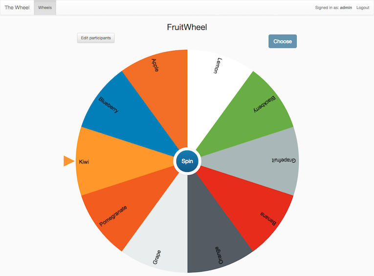

# Taller BVIF — Cómo ejecutarlo

En este archivo encontrarás indicaciones claras para ejecutar el taller BVIF con un escenario ficticio.

***

## Las tres fases del taller

| Fase | Objetivo | Responsable | Duración aprox. |
|---|---|---|---|
| **1. Preparación** | Dejar Kiro listo para ejecutar BVIF en la laptop de cada participante. | Trabajo previo de los participantes | Asíncrono, antes del taller |
| **2. Ejecutar el proceso BVIF** | Ejecutar las 7 etapas del proceso BVIF de principio a fin contra el escenario elegido, en Kiro. | Cada participante, con facilitación | La mayor parte del taller (90 min) |
| **3. Presentar resultados** | Cada participante o equipo presenta su cálculo final de valor de negocio y las decisiones que tomó en el camino. | Participantes, el facilitador modera | Bloque final del taller (5 min por persona — selección aleatoria de presentadores) |

Las secciones siguientes describen qué ocurre en cada fase.

***

## Fase 1 — Preparación

_Objetivo: que cada participante llegue al taller con un entorno funcional._

1. **Instala Kiro.** Sigue las instrucciones en [https://kiro.dev/](https://kiro.dev/).

2. **Crea una carpeta de espacio de trabajo vacía** en cualquier ubicación de tu máquina local donde tengas permiso de escritura (p. ej. `~/workspace-bvif/`). Kiro usará esta carpeta como directorio base de todos los artefactos BVIF.

   ```bash
   mkdir -p ~/workspace-bvif
   ```

3. **Copia los archivos del proyecto en ese espacio de trabajo.** Incluye `.kiro/`, `bvif-samples/`, `docs/` y `README.md` — las reglas de steering, los escenarios resueltos, las capturas de apoyo y el README del proyecto. Elige una de las dos opciones:

   **Opción A — Clonar con git** (si tienes SSH configurado hacia `gitlab.aws.dev`):

   ```bash
   cd ~/workspace-bvif
   git clone git@ssh.gitlab.aws.dev:maumunoz/kiro_for_bvif.git /tmp/kiro_for_bvif
   cp -R /tmp/kiro_for_bvif/.kiro /tmp/kiro_for_bvif/bvif-samples /tmp/kiro_for_bvif/docs /tmp/kiro_for_bvif/README.md .
   rm -rf /tmp/kiro_for_bvif
   ```

   **Opción B — Descargar un zip** desde la [página del proyecto en GitLab](https://gitlab.aws.dev/maumunoz/kiro_for_bvif) → haz clic en **Code** → **Download source code → zip**. Descomprime el archivo y copia `.kiro/`, `bvif-samples/`, `docs/` y `README.md` en tu espacio de trabajo.

   

   Tu espacio de trabajo debería verse así:

   ```
   ~/workspace-bvif/
   ├── .kiro/
   │   ├── steering/
   │   └── bvif-rule-details/
   ├── bvif-samples/
   │   ├── 0.workshop/
   │   ├── 1.bvif-scenarios/
   │   └── 2.bvif-docs/
   ├── docs/
   └── README.md
   ```

4. **Abre el espacio de trabajo en Kiro** (File → Open Folder…, selecciona la raíz del espacio de trabajo). Verifica que la regla de steering se cargó: haz clic en el **icono de Kiro** en la barra de actividad → expande **Agent steering & skills** → bajo **Workspace** deberías ver **core-workflow**.

   

***

## Fase 2 — Ejecutar el proceso BVIF

_Objetivo: que cada participante (o equipo) ejecute BVIF en Kiro y produzca un conjunto completo de artefactos, hasta llegar al informe final._

1. **Elige un escenario.** Explora la [carpeta de escenarios](https://gitlab.aws.dev/maumunoz/kiro_for_bvif/-/tree/main/bvif-samples/1.bvif-scenarios) y elige uno de los escenarios ficticios disponibles. El [resumen de escenarios](https://gitlab.aws.dev/maumunoz/kiro_for_bvif/-/blob/main/bvif-samples/1.bvif-scenarios/README.md) describe cada uno y cómo se comparan.

2. **Lee el guion (storyline).** Abre el archivo del guion dentro de la carpeta del escenario que elegiste y léelo por encima para familiarizarte con el cliente, el contexto y la iniciativa de IA propuesta. Interpretarás el papel de un representante del cliente al responder las preguntas de Kiro.

3. **Inicia una nueva sesión en Kiro.** Con el espacio de trabajo abierto, abre una nueva sesión de chat y cambia a **Vibe mode**. Escribe el prompt:

   > Run a business value identification for `<título de tu iniciativa de IA>`.

   Por ejemplo: _Run a business value identification for the initiative: predictive maintenance using AI._

   

   Este prompt solo arranca el proceso y nombra la iniciativa. Kiro solicitará el resto de los detalles en las etapas siguientes.

4. **Sigue las indicaciones en Kiro.** El agente recorre las 7 etapas de BVIF, deteniéndose para tu aprobación entre cada una. Responde los archivos de preguntas usando el guion como tu fuente de verdad. Cada interacción escribe artefactos en `bvif-docs/<NN>-<slug>-<yyyymm>/` en la raíz del espacio de trabajo y actualiza los archivos auxiliares de seguimiento, de modo que puedes cerrar y reabrir el espacio de trabajo en cualquier momento sin perder el progreso — el agente retoma donde se quedó.

   Este paso se completa cuando todas las subcarpetas de etapa — desde `00-session-setup/` hasta `07-final-results/` — están pobladas y se ha generado un informe de resultados final (`07-final-results/final-results.md`).

   > **Monitorea el progreso** abriendo estos dos archivos dentro de la carpeta de tu iniciativa:
   > - `bvif-state.md` — qué etapas están completas.
   > - `audit.md` — registro completo de cada interacción.

   > **Nota sobre la Etapa 5 (Recolección de datos):** Esta es la única etapa en la que Kiro puede pedirte compartir archivos. Puedes responder en línea (Kiro crea un archivo de preguntas con una entrada por cada dato) o subir documentos (Kiro crea `05-data-collection/uploads/` y lee los archivos que coloques ahí, extrayendo los datos).

***

## Fase 3 — Presentar resultados

_Objetivo: que cada participante o equipo presente lo que produjo, comparta su principal retroalimentación y reflexione con el facilitador y los demás participantes._

1. **Recorre tu entregable final de BVIF** en tu franja de tiempo asignada (normalmente 5 minutos por participante): la definición de la iniciativa, las métricas que seleccionaste, las decisiones de factibilidad que tomaste, los datos que recolectaste y el valor de negocio anualizado final.

2. **Comparte tus 2 principales comentarios** del ejercicio — qué funcionó bien, qué resultó confuso, qué cambiarías. Este es el aporte de aprendizaje más valioso que el facilitador y los demás participantes pueden recibir.

3. **Selección de presentador — "La Rueda".** Los presentadores se eligen al azar usando el mecanismo de [The Wheel](https://github.com/aws/aws-ops-wheel). El facilitador agrega el nombre de cada participante a la rueda y la gira para elegir quién presenta a continuación. Las diferencias entre presentaciones no son errores — muestran cómo un mismo guion puede producir legítimamente resultados distintos según las decisiones de criterio que se tomaron en el camino.

   
